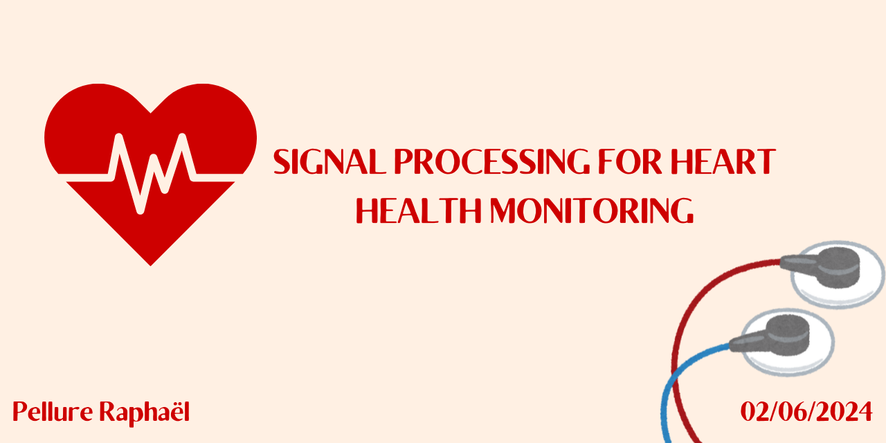

<!-- TITLE -->
<h1 align="left">👋 Hi, I'm Raphaël</h1>

<!-- SUBTITLE -->
<h3 align="center">A curious student developer excited to explore new ideas and innovative projects</h3>

<ul>
  <li>👨‍💻 I have a passion for coding, tackling complex problems, and continuously expanding my knowledge. I thrive on challenges and enjoy finding creative solutions..</li>
  <li>🚀 I just finished working on [Dernier Projet ici]
    <a href="https://github.com/Raphael-Pellure/MAT-Heart-Helth-Monitoring">.....</a>! It uses [technologies utilisées], and I tackled this project during my second year at <strong>ENSEEIHT Toulouse</strong>.
  </li>
  <li>📫 Feel free to reach out to me at <a href="mailto:raphael.pellure@etu.inp-n7.fr">raphael.pellure@etu.inp-n7.fr</a> or find me on 
    <a href="https://www.linkedin.com/in/raphaël-pellure">LinkedIn</a>.
  </li>
</ul>

<!-- CONTACT -->
<h4 align="left">Connect with me:</h4>

<!-- TOOLS -->
<h4 align="left">Languages and Tools:</h4>

  
  
  
  
  
  
  

  

  
  

<!-- GITHUB STATS -->

  

 

<!-- PROJECTS -->
<h1 align="left">My Projects</h1>

Here are some projects I’ve worked on. Check them out!

 

  
  <ul>
      <li><strong>What it's about:</strong> Analyzing PPG signals to monitor heart health, using spectral analysis, filtering, and statistical tests to detect conditions like arrhythmia, tachycardia, and bradycardia.
      <a href="https://github.com/Raphael-Pellure/MAT-Heart-Helth-Monitoring" target="_blank">Take a look!</a></li>
      <li><strong>Tech stack:</strong> Matlab, Data Preprocessing, Filtering, Statistical Analysis</li>
  </ul>

 

